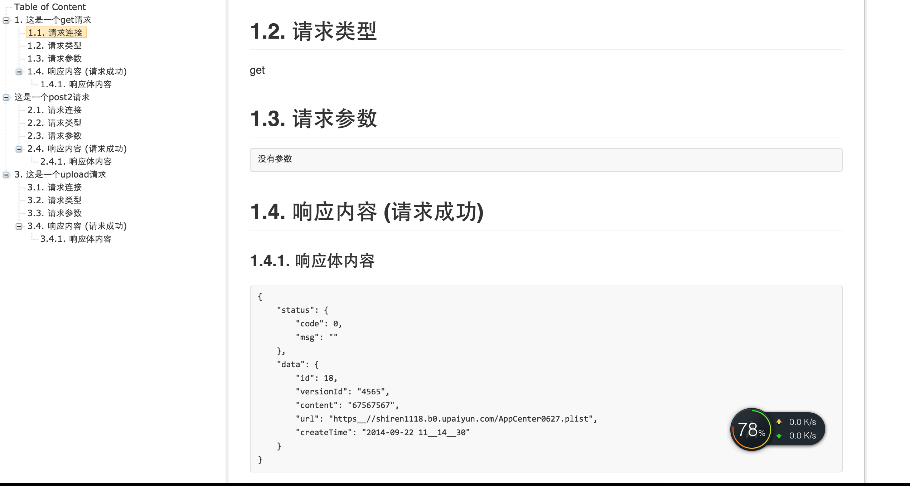

api-test
========

it is a api degign && doc tools

## Features

- [x] 支持get请求
- [x] 支持post请求
- [x] 支持upload请求(测试上传服务可以使用https://github.com/i5ting/upload-cli)
- [x] 支持markdown文档
- [x] 支持生成toc文档

## Install 

	[sudo] npm install -g api-test

## Run 

	cd somedir
	api

## for developer

### publish to npmjs.org

	npm start 
	
### mocha test
	
	npm test

### play

	npm run play
	

##Contributing

*  Fork it
*  Create your feature branch (git checkout -b my-new-feature)  
*  Commit your changes (git commit -am 'Add some feature')  
*  Push to the branch (git push origin my-new-feature)  
*  Create new Pull Request  

## History

- v1.1.3 增加req的desc属性，支持markdown格式
- v1.1.2 修改tpl路径问题
- v1.1.1 增加了get/post/upload请求，主要是upload部分
- v1.0.0 初始化版本

## Welcome fork and feedback

- write by `andy` andy_ios@163.com
- write by `i5ting` shiren1118@126.com

如有建议或意见，请在issue提问或邮件

## License

this repo is released under the [MIT
License](http://www.opensource.org/licenses/MIT).